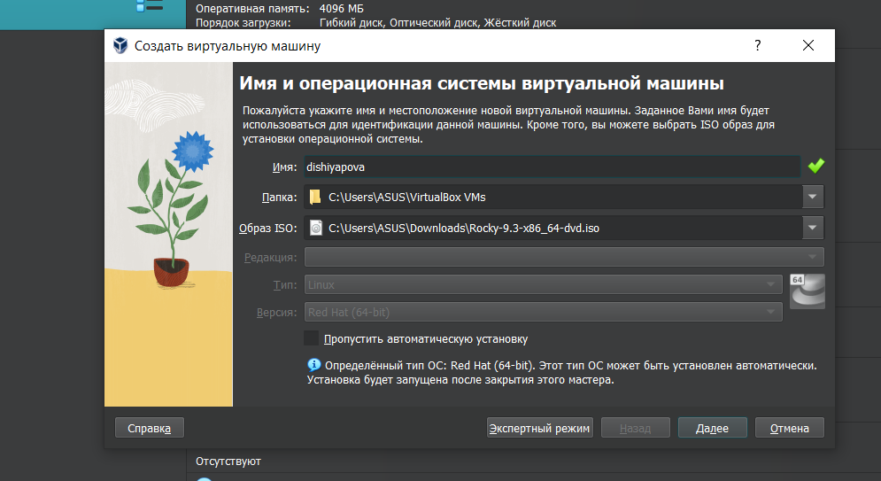
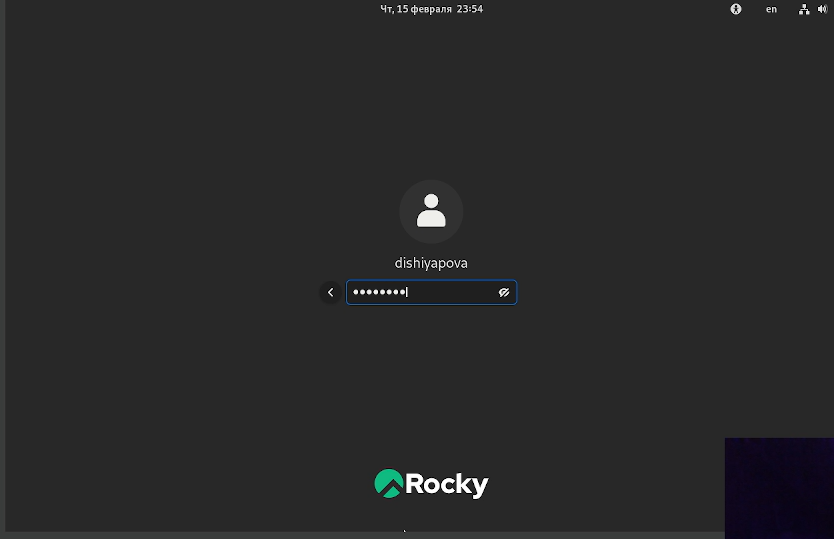
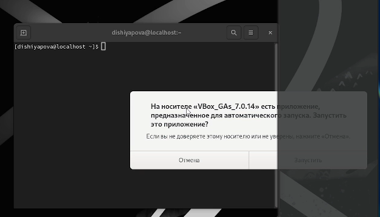
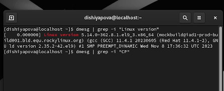

---
## Front matter
lang: ru-RU
title: Защита лабораторной работы 01
subtitle:
author:
  - Шияпова Д.И.
institute:
  - Российский университет дружбы народов, Москва, Россия

date: 17 февраля 2024


## i18n babel
babel-lang: russian
babel-otherlangs: english

## Formatting pdf
toc: false
toc-title: Содержание
slide_level: 2
aspectratio: 169
section-titles: true
theme: metropolis
header-includes:
 - \metroset{progressbar=frametitle,sectionpage=progressbar,numbering=fraction}
 - '\makeatletter'
 - '\beamer@ignorenonframefalse'
 - '\makeatother'
---

# Информация

## Докладчик

:::::::::::::: {.columns align=center}
::: {.column width="70%"}

  * Шияпова Дарина Илдаровна
  * студентка ФФМиЕН
  * Российский университет дружбы народов


:::
::: {.column width="30%"}


:::
::::::::::::::


## Цели и задачи

- Целью данной работы является приобретение практических навыков
установки операционной системы на виртуальную машину, настройки минимально необходимых для дальнейшей работы сервисов.


## Код для формата `pdf`

```yaml
slide_level: 2
aspectratio: 169
section-titles: true
theme: metropolis
```

## Формат `html`

- Используется фреймворк [reveal.js](https://revealjs.com/)
- Используется [тема](https://revealjs.com/themes/) `beige`

## Код для формата `html`

- Тема задаётся в файле `Makefile`

```make
REVEALJS_THEME = beige 
```
## Задание

На виртуальную машину установили Rocky Linux. Настроили виртуальную машину.Установили имени пользователя и названия хоста. Подключили образа диска дополнений гостевой ОС


## Теоретическое введение

Rocky Linux — это дистрибутив Linux, разработанный Rocky Enterprise Software Foundation. Предполагается, что это будет полный бинарно-совместимый выпуск, использующий исходный код операционной системы Red Hat Enterprise Linux

Один из дистрибутивов операционной системы на базе ядра Linux. Является ответвлением от проекта CentOS и, соответственно, бесплатным аналогом коммерческого Red Hat. Первый дистрибутив вышел в свет в 2021 году. Поводом для создания форка стал отказ компании Red Hat от поддержки стабильной версии CentOS, после чего главный разработчик проекта (Грегори Куртцер) объявил о создании нового дистрибутива под названием Rocky Linux.


## Выполнение лабораторной работы

:::
::: {.column width="50%"}

:::
::: {.column width="50%"}

:::
::: {.column width="50%"}


:::
::: {.column width="50%"}



## Выводы

Установили Rocky Linux.


## Получающиеся форматы

- Полученный `pdf`-файл можно демонстрировать в любой программе просмотра `pdf`
- Полученный `html`-файл содержит в себе все ресурсы: изображения, css, скрипты


## Результаты

- Установили Rocky Linux


