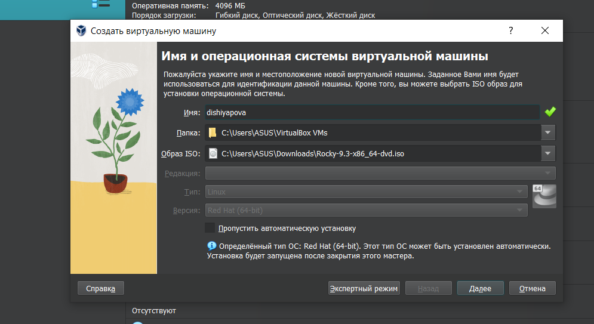
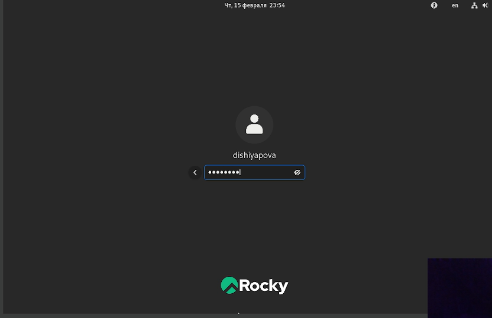
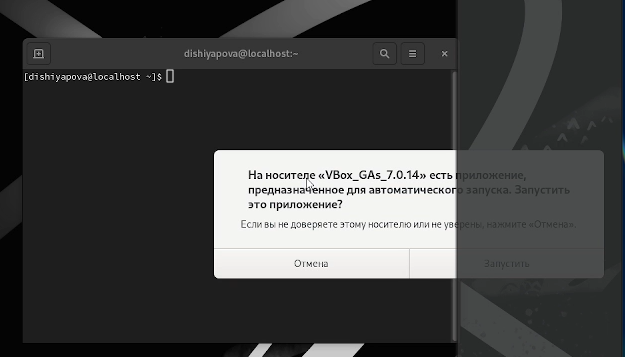
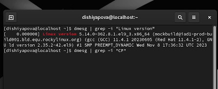

---
## Front matter
title: "Отчет по лабораторной работе 01"
author: "Шияпова Дарина Илдаровна"

## Generic otions
lang: ru-RU
toc-title: "Содержание"

## Bibliography
bibliography: bib/cite.bib
csl: pandoc/csl/gost-r-7-0-5-2008-numeric.csl

## Pdf output format
toc: true # Table of contents
toc-depth: 2
lof: true # List of figures
lot: true # List of tables
fontsize: 12pt
linestretch: 1.5
papersize: a4
documentclass: scrreprt
## I18n polyglossia
polyglossia-lang:
  name: russian
  options:
	- spelling=modern
	- babelshorthands=true
polyglossia-otherlangs:
  name: english
## I18n babel
babel-lang: russian
babel-otherlangs: english
## Fonts
mainfont: C059
romanfont: C059
sansfont: C059
monofont: C059
mainfontoptions: Ligatures=TeX
romanfontoptions: Ligatures=TeX
sansfontoptions: Ligatures=TeX,Scale=MatchLowercase
monofontoptions: Scale=MatchLowercase,Scale=0.9
## Biblatex
biblatex: true
biblio-style: "gost-numeric"
biblatexoptions:
  - parentracker=true
  - backend=biber
  - hyperref=auto
  - language=auto
  - autolang=other*
  - citestyle=gost-numeric
## Pandoc-crossref LaTeX customization
figureTitle: "Рис."
tableTitle: "Таблица"
listingTitle: "Листинг"
lofTitle: "Список иллюстраций"
lotTitle: "Список таблиц"
lolTitle: "Листинги"
## Misc options
indent: true
header-includes:
  - \usepackage{indentfirst}
  - \usepackage{float} # keep figures where there are in the text
  - \floatplacement{figure}{H} # keep figures where there are in the text
---

# Цель работы

Целью данной работы является приобретение практических навыков
установки операционной системы на виртуальную машину, настройки минимально необходимых для дальнейшей работы сервисов.

# Задание

На виртуальную машину установили Rocky Linux. Настроили виртуальную машину.Установили имени пользователя и названия хоста. Подключили образа диска дополнений гостевой ОС

# Теоретическое введение

Rocky Linux — это дистрибутив Linux, разработанный Rocky Enterprise Software Foundation. Предполагается, что это будет полный бинарно-совместимый выпуск, использующий исходный код операционной системы Red Hat Enterprise Linux

Один из дистрибутивов операционной системы на базе ядра Linux. Является ответвлением от проекта CentOS и, соответственно, бесплатным аналогом коммерческого Red Hat. Первый дистрибутив вышел в свет в 2021 году. Поводом для создания форка стал отказ компании Red Hat от поддержки стабильной версии CentOS, после чего главный разработчик проекта (Грегори Куртцер) объявил о создании нового дистрибутива под названием Rocky Linux.

# Выполнение лабораторной работы

Установили готовый образ диска. (рис. [-@fig:001]).
{#fig:001 width=70%}

Создали пользователя (рис. [-@fig:002]).
{#fig:002 width=70%}

(рис. [-@fig:003]).
{#fig:003 width=70%}

 Можно использовать поиск с помощью grep:
dmesg | grep -i "то, что ищем"
Получите следующую информацию.
1. Версия ядра Linux (Linux version).
2. Частота процессора (Detected Mhz processor).
3. Модель процессора (CPU0).
4. Объем доступной оперативной памяти (Memory available).
5. Тип обнаруженного гипервизора (Hypervisor detected).
6. Тип файловой системы корневого раздела.(рис. [-@fig:004]).
{#fig:004 width=70%}

# Выводы

Установили Rocky Linux.

::: {#refs}
:::
